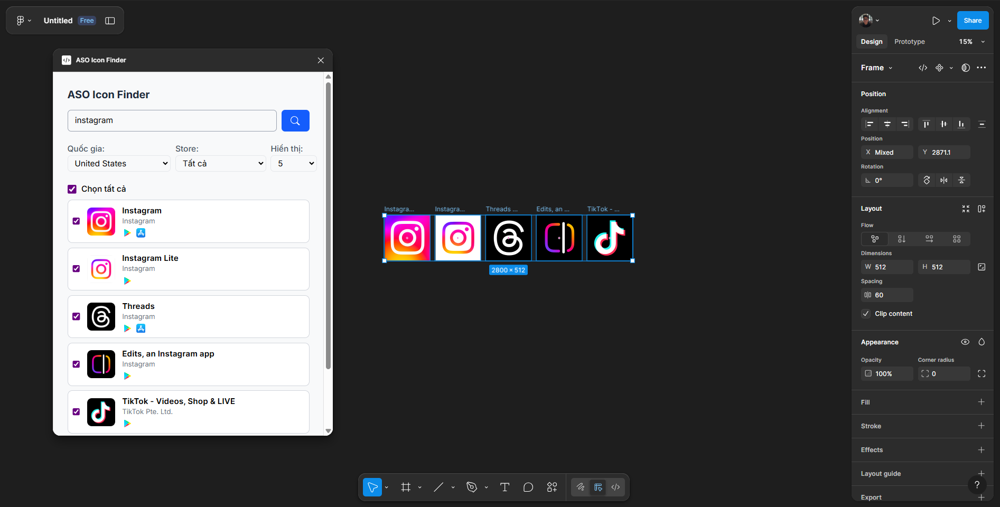

# Figma ASO Icon Finder API

## Giới thiệu

Serverless API sử dụng cho plugin [figma-aso-icon-finder](https://github.com/hunkadunkaa/figma-aso-icon-finder) được triển khai trên [Vercel](https://vercel.com/) dùng để giao tiếp giữa plugin **Figma** với **Google Play Store** và **Apple App Store**, giúp lấy thông tin icon ứng dụng và import vào trong **Figma**.



API sử dụng thư viện [google-play-scraper](https://github.com/facundoolano/google-play-scraper) và [app-store-scraper](https://github.com/facundoolano/app-store-scraper) để truy vấn và lấy dữ liệu icon, tên ứng dụng, nhà phát triển từ Google Play Store và Apple App Store.

## Tính năng

- Nhận request từ plugin Figma để tìm kiếm ứng dụng trên các store (fixed: 250 kết quả từ cả 2 store).
- Trả về danh sách ứng dụng phù hợp với từ khóa, bao gồm: appId, tên, icon, tên nhà phát triển.
- Phát hiện và hợp nhất các thông tin trùng lặp trên cả 2 store (app giống nhau cùng xuất hiện trên cả 2 store, sẽ ưu tiên kết quả trên Google Play Store nếu trùng).

## Cách sử dụng

### 1. Triển khai trên Vercel

- Clone repo này về máy.
- Đảm bảo đã cài đặt [Vercel CLI](https://vercel.com/docs/cli).
- Đặt biến môi trường `FIGMA_PLUGIN_API_KEY` trong dashboard Vercel hoặc file `.env`
- Deploy lên Vercel bằng lệnh:
  ```sh
  vercel --prod

### 2. Gọi API
* Endpoint: `https://<your-vercel-domain>/api/search`
* Method: `GET`
* Header:
    * `x-api-key`: API Key đã cấu hình
* Query params:
    * `term`: Từ khóa tìm kiếm (bắt buộc)
    * `country`: Mã quốc gia (mặc định: us)
    * `store`: App store tìm kiếm ('all' | 'google' | 'appstore')


Ví dụ:
```sh
GET https://<your-vercel-domain>/api/search?term=facebook&country=vn&store=all
Headers:
  x-api-key: <your-api-key>
```

### 3. Response

```json
{
  "data": [
    {
      "appId": "com.facebook.katana",
      "developer": "Meta Platforms, Inc.",
      "icon": "https://play-lh.googleusercontent.com/...",
      "store":
      {
        "appStore":
          {
            "appId":"284882215"
          }    
        "googlePlay":
        {
          "appId":"com.facebook.katana"
        }
      },
      "title": "Facebook"
    },
  ]
}
```

## Công nghệ sử dụng
* [Node.js 20.x](https://nodejs.org/)
* [google-play-scraper](https://github.com/facundoolano/google-play-scraper)
* [app-store-scraper](https://github.com/facundoolano/app-store-scraper)
* [Vercel](https://vercel.com/docs/functions/serverless-functions)

